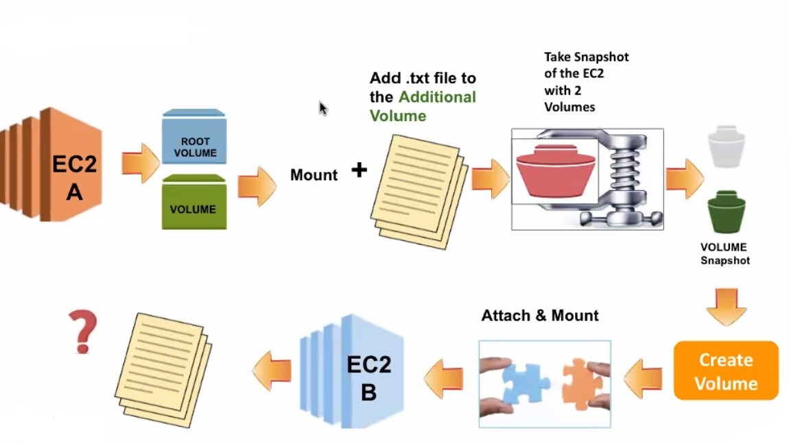

# Teamworks Projects

# Teamwork-Project-01 : Working with EC2s Snapshots, AMIs and Volumes

Purpose of this project is to learn how to take a snapshot of EC2 instances and volumes, create an image and volume from snapshots, attach and mount new volume to the EC2 created from custom image.



## Learning Outcomes

- At the end of the this project, students will be able to;
- take snapshots of EC2 instances and volumes on AWS console.
- create images and volumes from EC2 instances on AWS console.
- understand of difference between the image and the snapshot.
- create different types of AMI.
- copying and sharing AMI
- formatting and resizing additional volume and mounting to EC2.

## Outline

Part 1 - Creating an EC2 instance with an additional volume (10 GiB).

Part 2 - Mounting the additional volume and write some data (e.g. text file).

Part 3 - Creating a Snapshot, Image and Volume of Additional Volume from EC2 Instance

	   a) Creating snapshot of the EC2 instance with 2 volumes.

	   b) Creating an image from root volume's snapshot of EC2 instance.

	   c) Creating an additional volume (15 GiB) from additional volume's snapshot of EC2.

Part 4 - Creating an EC2 instance from image.

Part 5 - Attaching and Mounting EC2 and additional volume (15 GiB) and checking data inside the additional volume.

## Part 1 - Creating an EC2 instance with an additional volume (10 GiB).

- Launch an instance with following configurations.

  a. Security Group: Allow SSH and HTTP ports from anywhere with named "SSH and HTTP"

  b. Choose AZ-us-east-1a from subnet.

  c. Tag: We use tag to customize Instance!

  ```text
  Key: Name 
  Value: EC2A-10GiB  
  ```
 
  d. Add volume of 10GiB and click delete on termination.

  e. Launch the instance.

## Part 2 - Mounting the additional volume and write some data (e.g. text file).

- Connect your instance via SSH.

- Mount additional volume and write some data via codes below.

```text
# root volume and secondary volume should be listed
lsblk
df -h

# check if the attached volume is already formatted or not and has data on it.
sudo file -s /dev/xvdb

# if not formatted, format the new volume
sudo mkfs -t ext4 /dev/xvdb

# check the format of the volume again after formatting
sudo file -s /dev/xvdb

# create a mounting point path for new volume
sudo mkdir /mnt/2nd-vol

# mount the new volume to the mounting point path
sudo mount /dev/xvdb /mnt/2nd-vol/

# check if the attached volume is mounted to the mounting point path
lsblk

# show the available space, on the mounting point path
df -h

# check if there is data on it or not.
ls -lh /mnt/2nd-vol/

# if there is no data on it, create a new file to show persistence in later steps
cd /mnt/2nd-vol
sudo touch i-was-here.txt
sudo vi i-was-here.txt #Write some data inside file.
cat i-was-here.txt
```
## Part 3 - Creating a Snapshot, Image and Volume of Additional Volume from EC2 Instance

  - a) Creating snapshot of the EC2 instance with 2 volumes.

      - Go to `Snapshots` on left-hand menu.
      - Click on `Create snapshot` button.
      ```text

      Resource type: Instance
      Instance ID: Select your instannce EC2A-10GiB
      Description: EC2A-Snapshot

      Volumes: Keep it as it is.

      Tags:
        - Key: Name
        - Value: EC2A-Snapshot
      ```
      - List your snapshots.

  - b) Creating an image from root volume's snapshot of EC2 instance.

      - Go to `Snapshots` on left-hand menu.
      - Select root volume's(8 GiB) snapshot.
      - Click on `Actions` button and select  `Create image from snapshot`
      ```text

      Image name: EC2A-Image-For-EC2B
      Description: EC2A-Image-For-EC2B

      All others: Keep them as they are.

      ```
      - Click on `Create image` button
      - Go to `AMIs` on left-hand menu and check your image on the list.

  - c) Creating an additional volume (15 GiB) from additional volume's snapshot(10GiB) of EC2.

      - Go to `Snapshots` on left-hand menu.
      - Select additional volume's(10 GiB) snapshot.
      - Click on `Actions` button and select  `Create volume from snapshot`
      ```text

      Size: 15 GiB(Increase it)
      Availability Zone: us-east-1a (important)
      Tags:
        - Key: Name
        - Value: Additional-Vol-From-EC2A-to-EC2B
      
      ```
      - Click on `Create volume` button
      - Go to `Volumes` on left-hand menu and check your image on the list.

## Part 4 - Creating an EC2 instance(EC2B) from image.

  - Go to `Instances` on left-hand menu and click on `Launch instance`
  - Select ``My AMIs`` and find your image and select.
  ```text

      Size: 15 GiB(Increase it)
      subnet: Availability Zone us-east-1a (important)
      Tags:
        - Key: Name
        - Value: EC2B
      
  ```
  - Click on `Launch instance` button
  - Go to `Instances` on left-hand menu and check your instance on the list.

## Part 5 - Attaching and Mounting EC2 and additional volume (15 GiB) and checking data inside the additional volume.

  - Go to `Volumes` on left-hand menu and select `Additional-Vol-From-EC2A-to-EC2B` which is 15 GiB sized.
  - Click on ``Actions`` and select Attach volume.
  ```text

      Instance: EC2B
      Device name: keep it as it is.
      
  ```
  - Click on `Attach volume` button

- Connect your `EC2B` instance via SSH.

- Mount additional volume, resize and check data.

```text
# root volume and secondary volume should be listed
lsblk
df -h

# check if the attached volume is already formatted or not and has data on it.
sudo file -s /dev/xvdf

# check the mounting point path for new volume
cd /mnt/2nd-vol

# mount the new volume to the mounting point path
sudo mount /dev/xvdf /mnt/2nd-vol/

# check if the attached volume is mounted to the mounting point path
lsblk

# show the available space, on the mounting point path
df -h

#resize the volume to 15 GiB
sudo resize2fs /dev/xvdf

# show the available space, on the mounting point path after resize
df -h

# check if there is data on it or not.
ls -lh /mnt/2nd-vol/

# if there is no data on it, create a new file to show persistence in later steps
cd /mnt/2nd-vol
cat i-was-here.txt
```